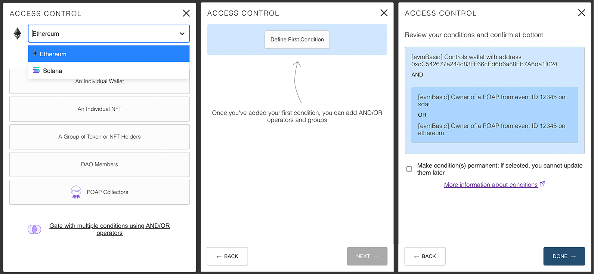

The Lit Share Modal v3 is a tool for creating access control conditions for securing content with Lit Protocol.
[Click here to visit the Lit Protocol developer docs.](https://developer.litprotocol.com/docs/intro/)

- Secure content based on wallet address, token/NFT holdings, POAP ownership, or DAO membership.
- Create multiple paths for unlocking content by using AND/OR operators.
- Set your most used tokens/NFTs as defaults for quick and easy access.



A Vanilla JS wrapper for the Lit Share Modal is also available.

- [Vanilla JS wrapper on GitHub](https://github.com/LIT-Protocol/lit-share-modal-v2-vanilla-js)
- [Vanilla JS wrapper on NPM](https://www.npmjs.com/package/lit-share-modal-v2-vanilla-js)

*Note for NextJS users:* If you are using NextJS, the CSS injection will not work.  Set the `injectCSS` prop to false, and
import the CSS file directly from `node_modules/lit-share-modal/dist/style.css` in `_app.tsx` or `_app.jsx`.

# Installation

with npm

```
npm install --save lit-share-modal-v3
```

with yarn

```
yarn add lit-share-modal-v3
```

# Usage

with React Hooks

```
import ShareModal from 'lit-share-modal-v3';
import { useState } from 'react';
import './App.css'

const App = () => {
  const [openShareModal, setOpenShareModal] = useState(false);

  const onUnifiedAccessControlConditionsSelected = (shareModalOutput) => {
    // do things with share modal output
  }

  return (
    <div className={'App'}>
      <ShareModal onClose={() => setOpenShareModal(false)}
                  showModal={openShareModal}
                  onUnifiedAccessControlConditionsSelected={onUnifiedAccessControlConditionsSelected} />
    </div>

  );
}

export default App;

```

# Props

### Required

- `onClose` - callback for actions to take on closing the modal
- `onUnifiedAccessControlConditionsSelected` - callback for the share modal output

`onUnifiedAccessControlConditionsSelected` provides an object with the following properties:

- `unifiedAccessControlConditions` - an array of objects and nested arrays reflecting the selected conditions
- `permanent` - a boolean signaling whether conditions will be permanent (true) or editable by the author in the
  future (false)
- `chain` - value of the current chain, `ethereum` or `solana`

Documentation on how these properties are used with the `LitJsSdk`, can be found in
the [LitJsSdk docs](https://lit-protocol.github.io/lit-js-sdk/api_docs_html/index.html#litnodeclientsavesigningcondition)

### Optional

- `darkTheme` - `false` by default. Setting as `true` to enable dark mode.
- `defaultChain` - `ethereum` by default.  Can be set to `solana` to make Solana the default chain on load.
- `allowChainSelector` - `true` by default. Setting as `false` will prevent users from switching between different chain conditions types e.g. switching from Ethereum to Solana.
- `allowMultipleConditions` - `true` by default. Setting to `false` will disable the multiple conditions screen and only allow the creation of single control conditions.
- `permanentDefault` - `false` by default. Setting to `true` will check by default the box that makes conditions uneditable.
- `isModal` - `true` by default. Setting to `false` will hide the close icon in the header.
- `allowDevMode` - `false` by default.  Setting to `true` will show logs if there are prop type errors and enable the ability to see the raw access control conditions in JSON format.
- `defaultTokens` - set quick access tokens that appear in the `Select a Token/NFT` menu.  More information below
- `injectCSS` - a boolean that is set to true by default. When this is true, the CSS styles will be injected into
  the `<head>` tag of the page when it loads, so there is no need to import any css. You can set this to `false` if you
  want to use your own CSS.  For small changes, it's recommended to use the `cssSubstitution` object instead.
- `cssSubstitution` - empty object by default.  Allows pinpoint the customization of different components in the share modal.  More documentation will be available soon.

### `defaultTokens` prop

Defines tokens at the top of the select menu for easy access.  `LitGate` is included by default, but this list can be customized by passing an array of objects with the following properties:

- `label` - name of token/NFT
- `logo` - url of token/NFT favicon
- `value` - token/NFT address
- `symbol` - token/NFT symbol
- `standard` - token standard (ERC20, ERC721, or ERC1155)

**Example of a single entry quick access array**

```
export const defaultTokens = [
  {
    label: "Lit Genesis Gate",
    logo: "https://litgateway.com/favicon.png",
    value: "0xA3D109E28589D2AbC15991B57Ce5ca461Ad8e026",
    symbol: "LITGATE",
    standard: "ERC721",
  }
];
```

### `cssSubstitution` prop

More information coming soon
